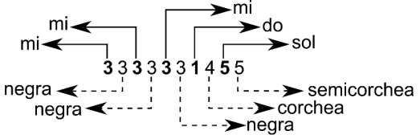

# Pregunta 2
La siguiente tabla muestra las notas y las figuras musicales:

| **Nota Musical**           |                  | **Figura Musical**                 |         |         |
|------------------------|------------------|--------------------------------|---------|---------|
| **Numero**                    | **Nombre**           | **Numero**                             | **Nombre**  | **Tiempo**  |
| 1                     | do               | 1                              | redonda | 64      |
| 2                     | re               | 2                              | blanca  | 32      |
| 3                     | mi               | 3                              | negra   | 16      |
| 4                     | fa               | 4                              | corchea | 8       |
| 5                     | sol              | 5                              | semicorchea | 4   |
| 6                     | la               | 6                              | fusa    | 2       |
| 7                     | si               | 7                              | semifusa| 
1       |


Una partitura musical puede ser codificada como un número entero. Cada par de dígitos, leídos de derecha a izquierda, representa una nota (número entre 1 y 7) y una figura (número entre 1 y 7). Por ejemplo, 3333331455 representa a:

55: sol semicorchea \
14: do corchea \
33: mi negra \
33: mi negra \
33: mi negra 



Para procesar las partituras, el módulo musical contiene las funciones indicadas en la siguiente tabla:

| Contrato             | Propósito                                                                                 | Ejemplo                                           |
|----------------------|--------------------------------------------------------------------------------------------|--------------------------------------------------|
| nota: int → str      | Recibe un número entero del 1 al 7, y devuelve un string con la nota correspondiente       | nota(4) devuelve "fa"                             |
| figura: int → str    | Recibe un número entero del 1 al 7, y devuelve un string con la figura correspondiente     | figura(5) devuelve "semicorchea"                 |
| tiempo: str → int    | Recibe un string con una figura, y devuelve un número entero con la duración asociada     | tiempo("blanca") devuelve 32                     |
| largo: int → int     | Recibe un número entero que representa una partitura, y devuelve la cantidad de notas     | largo(3333331455) devuelve 5                     |
| correcta: int → bool | Recibe un número entero y devuelve True si representa una partitura válida, o False si no | correcta(1892) devuelve False                    |


**A) (2.5 ptos.)** Escriba la función de encabezamiento `def duracion(P)`, que recibe un número entero (de un número
desconocido de dígitos) que representa una partitura correcta, y entrega la suma de los tiempos de todas sus figuras. \
Ejemplo: `duracion(3333331455)` entrega 60 (4 + 8 + 16 + 16 + 16).


**B) (3.5 ptos.)** Escriba un programa que pregunte por una partitura y luego muestre las notas y sus figuras respectivas, y al final muestre la duración total de la partitura, estableciendo un diálogo similar a los que se muestran en los siguientes dos ejemplos. Tenga presente que el número ingresado por el usuario no es conocido de antemano:

```python
Partitura? 3333331455       Partitura? 123
sol semicorchea             No corresponde a una partitura
do corchea
mi negra
mi negra
mi negra
La duracion es: 60
```
Indicación: Escriba un procedimiento recursivo que muestre en pantalla cada nota y su figura. Un "procedimiento
recursivo" es una "función recursiva" que no retorna un valor.