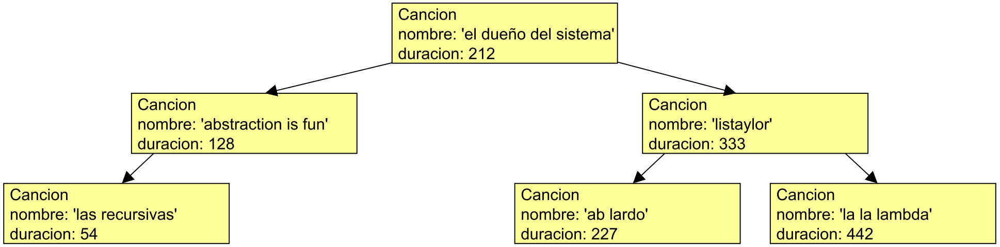

# Arboles de canciones

El gran `DJAlvarez` está preparando su repertorio de canciones para su concierto de fin de año. Para ello, utiliza un Árbol de Búsqueda Binaria (ABB) donde guarda las canciones, y cada canción es representada como una estructura, que almacena su nombre y duración en segundos (el ABB está ordenado por duración, y puede asumir que no hay dos canciones que duran lo mismo).

```python
# Cancion: nombre(str) duracion(int)
estructura.crear('Cancion','nombre duracion')

# suponga que existe la variable abbCanciones, que almacena el ABB de mas abajo
```



Para ayudarle en su puesta en escena, le pide ayuda con lo siguiente:

**a)** Cree la función `agregarCancion(A,nombre,dur)`, que entrega el árbol $A$ con una nueva canción, de nombre y duración indicados. Ejemplo:

  - `agregarCancion(abbCanciones, 'pythonisa', 180)` agrega la canción a la derecha del nodo `'abs.. is fun'`.

**b)** Cree la función `duraderas(A, s)`, que dado un ABB de canciones y una cantidad de segundos, entrega una lista con las canciones de $A$ que duren al menos `s` segundos. Ejemplo:
  
  - `duraderas(abbCanciones, 300)` entrega una lista con las canciones `'listaylor'` y `'la la lambda'`.
 
**Indicación:** Puede asumir que existe la función `juntar(L1,L2)` que pega el contenido de L2 al final de L1.

**c)**  Cree la función `repertorio(A)`, que dado un ABB de canciones, entrega una lista con todas las canciones de $A$ ordenadas por duración de menor a mayor.