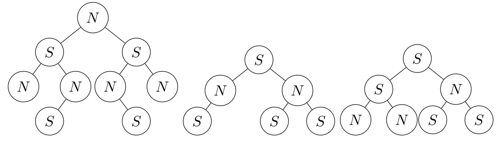

# Arboles Magnéticos

Los arboles _magnéticos_ se definen como los arboles binarios cuyos nodos no pueden estar conectados a otros nodos que tengan el mismo contenido que el. Por definición, un `arbolVacio` y un árbol con 1 solo valor siempre se consideran magnéticos.Por ejemplo, de los siguientes árboles, los primeros dos son magnéticos, pero el tercero no. 

Al respecto, cree la función `validarMagnetico(A)`, que recibe una estructura de tipo Árbol Binario, y debe entregar `True` si corresponde a un árbol _magnético_ y `False` en caso contrario. Ejemplos:

  - `validarMagnetico(AM1)` entrega `True`
  - `validarMagnetico(AM3)` entrega `False`

**Indicación:** Se recomienda revisar cuidadosamente cada caso posible (ambas ramas vacías, una rama vacía, ambas ramas no vacías, etc...).

