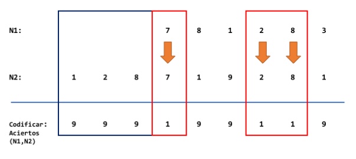

# Codificar Aciertos

Cree una función llamada `codificarAciertos` que recibe dos números enteros positivos n1 y n2, y devuelve los aciertos y las fallas, codificadas en un número cuyos dígitos son solo unos y nueves. Se puede visualizar el comportamiento de la función con el siguiente ejemplo:

Note que en aquellas posiciones donde hay igualdad, debe ir un 1. En cambio, donde no hay igualdad, o bien no hay número con el que comparar, debe ir un 9.

